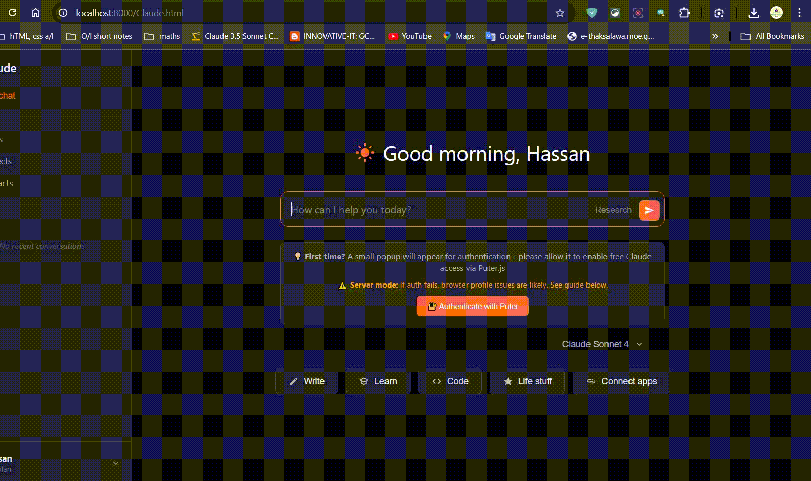

# 🤖 Free, Self-Hosted Claude AI Interface

A fully functional, polished, and self-hosted web interface for Anthropic's Claude AI. This project runs entirely in your browser, using the free tier of **Puter.js** for secure access to the Claude API. No backend, no server costs, 100% free.

---

### ✨ Live Demo




---

### 🚀 Key Features

*   ✅ **100% Free Access:** Leverages the free tier of Puter.js to interact with the Claude API at no cost.
*   🎨 **Polished UI:** A clean, modern interface inspired by the official Claude UI, with light and dark mode support.
*   📄 **Artifact Generation:** Automatically renders code blocks into beautiful, interactive "artifact" canvases with syntax highlighting, copy, download, and even an HTML preview feature.
*   💬 **Streaming Responses:** Watch Claude's responses appear in real-time, just like the official experience.
*   📂 **Local Chat History:** Remembers your recent conversations in your browser's local storage.
*   🔐 **Secure Authentication:** Handles Puter.js authentication directly in the browser with a clear, user-friendly flow.

---

### ❓ How It Works

This interface does **not** use a pirated or reverse-engineered API. It uses the official, legitimate **Puter.js** library. When you first use the app, it will ask for a one-time authentication with your Puter account. This securely connects the web app to **your own account's** free Claude API access, ensuring everything is secure and above board.

---

### ▶️ Getting Started (How to Run)

Because browsers have security rules (CORS), you cannot simply open the `index.html` file directly. You must run it from a **local web server**. I've made this easy for you.

### ✅ Prerequisites

This project has minimal dependencies, making it very easy to set up. All you need is:

1.  **🐍 Python 3:**
    *   This is **only** required to run the simple local web server. The application itself is 100% JavaScript.
    *   **No `pip` packages are needed.** The `http.server` module is included with Python by default.
    *   Most macOS and Linux systems have Python pre-installed. For Windows, you can download it from [python.org](https://www.python.org/downloads/).

2.  **🌐 A Modern Web Browser:**
    *   Google Chrome, Mozilla Firefox, Microsoft Edge, or Safari.

That's it! There are no other libraries or frameworks to install.

#### For Windows Users (Easiest Method):

1.  **Download:** Download this project as a ZIP file and extract it.
2.  **Run the Script:** Simply double-click the `run_server.bat` file.
3.  **Open:** A command prompt will appear, and your default web browser will automatically open to `http://localhost:8000`. That's it!

#### For Mac / Linux / Other Users:

1.  **Download:** Download this project as a ZIP file and extract it.
2.  **Open Terminal:** Open your terminal or command prompt and navigate into the project folder.
3.  **Run Server:** Run the following command:
    ```bash
    python -m http.server 8000
    ```
4.  **Open Browser:** Open your web browser and go to the address `http://localhost:8000`.

**First Use:** The first time you send a message, a small popup will appear asking you to authenticate with Puter. Please **allow the popup** to enable the free AI access.

---

### ❤️ Support The Project

If you find this tool useful, please consider making a small donation to support future development. Thank you!

<a href="https://www.paypal.com/paypalme/itkcartoons" target="_blank">
  
</a>

---

### 🛠️ Tech Stack

*   **Core:** Vanilla JavaScript (ES6+), HTML5, CSS3
*   **API Integration:** Puter.js SDK (`@puter.com/v2`)
*   **Development:** No frameworks, just pure, efficient code.

---

### 📄 License

This project is licensed under the **MIT License**.
